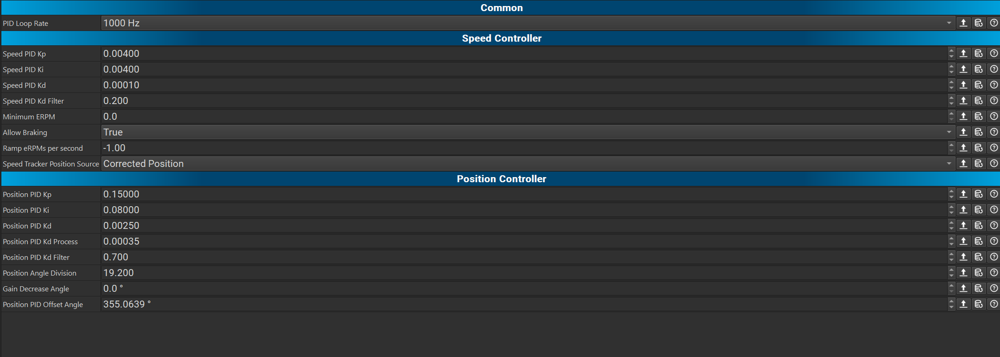

# VESC

# Index
1. [Software](#software)
2. [Setting-up](#set)

## Software 

You can find the VESC software in the repositories (path: [VESC_tool_6.02](https://github.com/JordanLaw/robocon/tree/9d138ca345b671d4a66e2e8c82a524e70ce1fe27/vesc)). Or you can download VESC Tool from [VESC Project Website](https://vesc-project.com/vesc_tool) (You need to create an account)

  
  

## Setting-up 

It is an example of a connection with VESC and motor.

  
  

## Getting start

### Calibration: Wizards for setting up motor FOC

Click the “Welcome & Wizards” button and the “Setup Motors FOC” button

  

At the beginning, it will ask you to restore the motor drive into default setting, please choose “NO” if you have already calculated the motor drive before. If you click “YES”, you will need to configure all the Motor Setting and App Setting one more time.

  

You can choose the usage type of your motor depend on how you will rub your motor. this time we will choose “Generic”.

  

Then, you need to choose the size or type of your motor. Usually, we are using “Small Outrunner (~200 g)”, it depends on what kind of motor you are using. 

  

Warning will pop up to remind you if the type of the motor is wrong, the motor will be destroyed. So, make sure the type of the motor is correct before you click “YES”.

  

Next, you need to choose the right parameter which fix to your battery. If depends on what kind of battery you are using.

  

Below figures are example, it show how to know the number of cells series.

1. Check the label on the packet. "P" part means Parallel. The "S" part means "Series". "6S1P" means 6 cells in serises, 1 parallel. Therefore, we should type 6 in the box.

!!!!!! Warning !!!!!! 
Don't mxied up the "Series" and "Parallel", you should type the number of "Series". 
Otherwise it may damage the vesc, motor and battery
!!!!!!!!!!!!!!!!!!!!!!!!!!!!!!!!!!!!!!!!!!!!!!!!!!!!!!!!!!!!!!!!!!!!!!!!!!!!!!!!!!!!!!!!!!!!!!!!!!!!!!!!!!!!!!!!!!!!!!!!!!!!!!!!!!!!!!!!!!!!!!!!!!!!!!!!!!!!!!!!!!!!

  

2. Count number of the packet number.

  

Warning will pop up to remind you if the type of the battery is wrong, the battery will be destroyed. So, make sure the type of the battery is correct before you click “YES”.

  

Next, For the Gear ratio and the Wheel Diameter, it is just for the log analysis (not sure). If you are not using the data provided from the VESC, you can click Direct Drive and use the default Wheel Diameter.

For the Motor Poles, please refer what kind of motor you are using, there should be a number of motor poles shown on that motor datasheet.

After you fill up all the parameter, you can start the detection by clicking the “RUN DETECTION”

  

A window will pop up and show you all the motor status, you can still change the value if you are not happy with that in the "FOC" tab.

  
  

### Test the calibration or run the motor with VESC

Now, you can test the calibration of the motor is well or not. To control the motor using VESC, you need to enbale keyboard control by clicking the tab on the right hand side. Also, you can review the realtime data by clicking the tab below the keyboard control tab. After you enable the keyboard, you can use Arrow keys to control the motoe spin.

Up and Down arrow key -> current control 
Right and Left arrow key -> duty control 

  

Also, you can use the command platform at the bottom of the VESC app.
1. Duty control - control the speed of the motor based on the percentage of voltage you set
2. Current control - control the speed of the motor based on the current you set
3. RPM control - control the speed of the motor based on the RPM you set, it need to adjust the PID parameter in order t have a well performance
4. Postion control - turn the motor directon into required angle, need to adjust the PID parameter as RPM control
5. Full break
6. Switch off

  

if you want to review the realtime status of your motor, you can click the "Realtime Data" tab on the left hand side in the app. There are few things you can review, Current put into the motor, the temperature of VESC, RPM of your motor, the position of your motor (if you have encoder).

  

### Sensorless motor setting up

In case, you don't have a encoder for your motor, you can configure your motor from "Sensorless" tab in the "FOC".

Normally, you need to change a higher "Openloop ERPM" in order to start the motor in the senorless mode. (example: 12,000). You can change the value depand on the type of your motor.
Also, you can set a longer time for the "Openloop Ramp Time" which can avoid lagging at the beginning.

  

## Motor Setting

### Motor Detection:

if the direction of your wheel is not correct, you can revert the direction of the motor in this tab. (True or False)

  

### Current:

You can limit the max current of the motor driver put in order to avoid overcurrent. if you have already done the wizards of the setting-up motor FOC, you may not need to change this value because it have already calculate the max current of the motor can afford. However, you can still set a lower maximum current in this tab.

Also, there is a value called Absolute Maximum Current which means that if the current over this value, it will stop the motor immediately and print a fault message in the VESC terminal.

  

### Limitation of RPM:

You can set a limitation of ERPM of the motor, if you command a ERPM over this amount, the motor driver will only call the limited amount in stead of the amount you command.

  

### PID control setting

A proportional–integral–derivative controller (PID controller or three-term controller) is a control loop mechanism employing feedback that is widely used in industrial control systems and a variety of other applications requiring continuously modulated control. A PID controller continuously calculates an error value 𝑒(𝑡) as the difference between a desired setpoint (SP) and a measured process variable (PV) and applies a correction based on proportional, integral, and derivative terms (denoted P, I, and D respectively), hence the name.

Proportional (P) control: This component adjusts the output of the process based on the current error between the setpoint and the process variable (PV). The larger the error, the larger the correction applied.

 

Integral (I) control: This component adjusts the output based on the accumulated error over time. It helps eliminate steady-state error and can improve the stability of the control system.

 

Derivative (D) control: This component adjusts the output based on the rate of change of the error. It helps to dampen oscillations and improve the stability of the control system but is often omitted because PI control is sufficient. The derivative term can amplify measurement noise (random fluctuations) and cause excessive output changes. Filters are important to get a better estimate of the process variable rate of change.

 

So, all together the output will be:

 

For example, there is the difference between before and after PID controller tuned.

Before:

After:

#### PID controller tuning

In VESC, there is a place that you can tune the PID controller of your motor. On the left hand side of the window, there is a tab called "PID controllers".

1. RPM PID contorl - when you are using ERPM value to control the motor, you need to adjust the speed kp, ki and kd in order to optimize the performance.
2. Minimum ERPM - VESC will ignore all the ERPM control command under this value
3. Ramp ERPM per second - acceleration of your motor
4. Position PID control - when you are control your motor to turn to specific angle, you need to adjust the position kp, ki and kd in order to optimize the performance.
5. Position Angle Division - Angle division for the position controller. Can be used to map one control rotation to several motor rotations.
6. Angle off-set - Angle offset for the position controller.

  

## Fault / Error

if the light color of the VESC turned from green to red, that means that there is something error in the process f running the motor. In order to watch the fault or error, you can go to VESC to check the problem. (if you are connecting the VESC, you can find that a warning which show the name of the error will pop up on the right-bottom of the window)

  
  

if you want to find out the details of the error, there is a tab which called "Print Faults" in the "Terminal" tab. by clicking this, you can find out the details of the error. 

For example, "FAULT_CODE_ABS_OVER_CURRENT" existed, it means that when you were controlling the motor, there was a over-current and the VESC cut the current immediately. To solve the problem, you may need to either set a higher value of max absolute current limiation or stop the e-stop function and report only in the VESC (not recommended).

  
  

## Can bus communication

## STM32 borad coding

