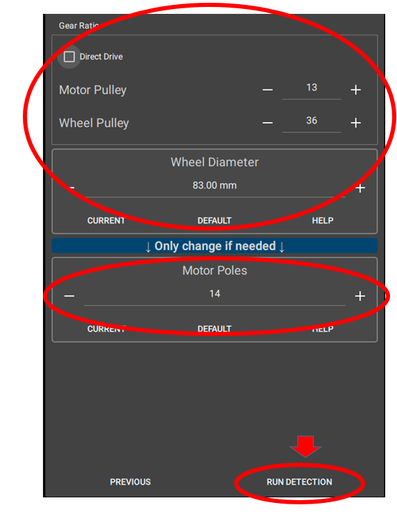

# VESC

## Software

You can find the VESC software in the repositories (path: [VESC_tool_6.02](https://github.com/JordanLaw/robocon/tree/9d138ca345b671d4a66e2e8c82a524e70ce1fe27/vesc)). Or you can download VESC Tool from [VESC Project Website](https://vesc-project.com/vesc_tool) (You need to create an account)

  
  

## Setting-up

It is an example of a connection with VESC and motor.

  
  

## Getting start

### Wizards for setting up motor FOC

Click the “Welcome & Wizards” button and the “Setup Motors FOC” button

  

At the beginning, it will ask you to restore the motor drive into default setting, please choose “NO” if you have already calculated the motor drive before. If you click “YES”, you will need to configure all the Motor Setting and App Setting one more time.

  

You can choose the usage type of your motor depend on how you will rub your motor. this time we will choose “Generic”.

  

Then, you need to choose the size or type of your motor. Usually, we are using “Small Outrunner (~200 g)”, it depends on what kind of motor you are using. 

  

Warning will pop up to remind you if the type of the motor is wrong, the motor will be destroyed. So, make sure the type of the motor is correct before you click “YES”.

  

Next, you need to choose the right parameter which fix to your battery. If depends on what kind of battery you are using.

  

Warning will pop up to remind you if the type of the battery is wrong, the battery will be destroyed. So, make sure the type of the battery is correct before you click “YES”.

  

Next, For the Gear ratio and the Wheel Diameter, it is just for the log analysis (not sure). If you are not using the data provided from the VESC, you can click Direct Drive and use the default Wheel Diameter.

For the Motor Poles, please refer what kind of motor you are using, there should be a number of motor poles shown on that motor datasheet.

After you fill up all the parameter, you can start the detection by clicking the “RUN DETECTION”

  

A window will pop up and show you all the motor status, you can still change the value if you are not happy with that in the "FOC" tab.

  
  

### Sensorless motor setting up

In case, you don't have a encoder for your motor, you can configure your motor from "Sensorless" tab in the "FOC".

Normally, you need to change a higher "Openloop ERPM" in order to start the motor in the senorless mode. (example: 12,000). You can change the value depand on the type of your motor.
Also, you can set a longer time for the "Openloop Ramp Time" which can avoid lagging at the beginning.

  

## Motor Setting

### Motor Detection:

if the direction of your wheel is not correct, you can revert the direction of the motor in this tab. (True or False)

  

### Current:

You can limit the max current of the motor driver put in order to avoid overcurrent. if you have already done the wizards of the setting-up motor FOC, you may not need to change this value because it have already calculate the max current of the motor can afford. However, you can still set a lower maximum current in this tab.

Also, there is a value called Absolute Maximum Current which means that if the current over this value, it will stop the motor immediately and print a fault message in the VESC terminal.

  

### Limitation of RPM:

You can set a limitation of ERPM of the motor, if you command a ERPM over this amount, the motor driver will only call the limited amount in stead of the amount you command.

  

## Fault / Error

if the light color of the VESC turned from green to red, that means that there is something error in the process f running the motor. In order to watch the fault or error, you can go to VESC to check the problem. (if you are connecting the VESC, you can find that a warning which show the name of the error will pop up on the right-bottom of the window)

  
  

if you want to find out the details of the error, there is a tab which called "Print Faults" in the "Terminal" tab. by clicking this, you can find out the details of the error. 

For example, "FAULT_CODE_ABS_OVER_CURRENT" existed, it means that when you were controlling the motor, there was a over-current and the VESC cut the current immediately. To solve the problem, you may need to either set a higher value of max absolute current limiation or stop the e-stop function and report only in the VESC (not recommended).

  
  

## Can bus communication

## STM32 borad coding

